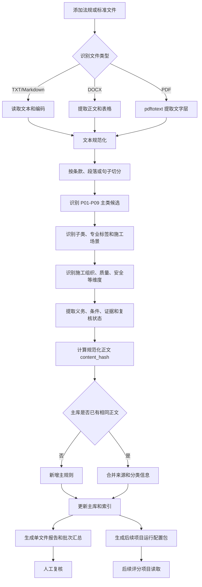

# 标书评分项目阶段性工作汇报

> 汇报日期：2026 年 9 月 23 日  
> 当前阶段：法规标准批量处理与规则库基础建设  
> 项目目录：`D:\Code\Codex\标书评分项目`  
> 软件名称：工程建设项目法规标准批量处理器（C++ / Qt）

---

## 一、项目目标

本项目最终目标是建设一套面向工程建设项目的标书评分辅助系统，将项目资料、招标文件、法律法规、工程建设标准和评审因素组织成可追溯、可复核、可配置的评审规则。

当前阶段先解决法规和标准的基础数据问题：把 PDF、DOCX、TXT、Markdown 等文件中的条款提取出来，按照工程项目九大类进行分类，形成统一主规则库，并导出后续评分项目能够读取的配置包。

当前阶段的工作定位是：

```text
原始法规和标准文件
    → 条款提取与结构化
    → 九大类及多层标签分类
    → 主规则库去重与索引
    → 后续评分项目可读取的运行配置包
```

---

## 二、阶段性结论

目前已经完成法规标准批量处理软件的主体框架和核心处理链路，软件可以启动并进行内部测试，已具备以下能力：

1. 批量读取本地法规、标准和相关工程文件；
2. 提取正文并拆分为条款；
3. 按 P01—P09 九大类识别工程适用范围；
4. 继续识别子类、专业标签、施工场景和横向规则维度；
5. 对相同正文进行精确去重并追加来源；
6. 建立主规则库和多层索引；
7. 提供规则库查看和人工复核界面；
8. 生成后续评分项目可读取的法规运行配置包；
9. 提供编译、部署、启动脚本和操作文档。

当前成果属于“可运行、可测试、可继续扩展”的阶段版本。正式用于自动评分前，还需要完成法规有效性核验、人工审核闭环、正式规则数据建设和评分项目代码接入。

---

## 三、当前完成情况总表

| 工作模块 | 当前状态 | 已完成内容 |
|---|---|---|
| 九大类基础框架 | 已完成 | 建立 P01—P09、59 个子类、38 个专业标签、18 个施工场景和 7 个横向维度 |
| Qt 主程序 | 已完成 | 文件队列、路径配置、批处理、进度、日志和功能入口 |
| Qt Designer 界面 | 已完成 | 主窗口、人工复核窗口、规则库管理窗口均保留 `.ui` 文件 |
| 文件批量读取 | 已完成 | 支持 PDF、DOCX、TXT、Markdown 和递归添加文件夹 |
| 条款提取与切分 | 已完成 | 支持“第 X 条”、段落和句子切分，保留来源文件及页码信息 |
| 自动分类 | 已完成 | 主类候选、子类、专业标签、施工场景、维度、分类证据和复核状态 |
| 主规则库 | 已完成 | 统一规则模型、来源追溯、状态、版本和正文哈希 |
| 精确去重 | 已完成 | 按规范化正文 SHA-256 去重，相同正文合并来源和分类信息 |
| 多层索引 | 已完成 | 主类、子类、专业标签和施工场景索引 |
| 单文件报告 | 已完成 | JSON、CSV、Markdown、提取文本和批次汇总 |
| 人工复核界面 | 已完成基础功能 | 可查看条款、机器依据、修改分类、填写备注并另存复核文件 |
| 规则库管理界面 | 已完成基础功能 | 支持搜索、主类筛选、维度筛选、状态筛选和详情查看 |
| 后续项目运行包 | 已完成 | 生成法规包、ProjectProfile、分类目录、映射、主库快照和清单 |
| Qt 部署 | 已完成 | 提供 `windeployqt` 部署脚本和必要 Qt/MinGW 运行库 |
| ZIP 项目重构 | 按计划暂未实施 | 当前只确定输入协议，没有修改原 ZIP 项目代码 |
| 正式法规规则库 | 待建设 | 需要批量导入真实法规、人工审核并确认现行有效性 |
| 自动评分链路 | 待建设 | 需要后续完成规则与招标评审因素、评分项和处置动作的映射 |

---

## 四、分类逻辑已经明确

当前系统将分类信息分成四个不同层次：

| 层次 | 作用 | 当前数量 |
|---|---|---:|
| P01—P09 九大类 | 按主要工程对象和工程场景进行项目路由 | 9 |
| 二级子类 | 在九大类内部继续细分工程对象或工程形态 | 59 |
| 专业标签和施工场景 | 补充专业、工艺、作业环境和项目条件 | 38 个专业标签、18 个场景 |
| 横向规则维度 | 用于评审和检索，可跨九大类复用 | 7 |

七个横向维度包括：施工组织、质量、安全、进度、资源、环境、合同招投标。

九大类和横向维度不能混用。例如，“基坑支护验收”可以属于 P01 房屋建筑主类，同时具有地基基础子类、深基坑场景、质量维度和安全维度。质量和安全不是新的项目主类。

本系统的 P01—P09 是面向当前标书评审业务建立的业务分类框架，不表述为国家统一法定工程分类。

---

## 五、软件处理流程



### 5.1 当前 Qt 软件负责的流程

```text
法规/标准文件
    → 提取条款
    → 分类和标注
    → 主库去重及索引
    → 运行配置包
```

### 5.2 后续评分项目负责的流程

```text
项目资料和招标文件
    → 确定 ProjectProfile
    → 选择九大类、子类、标签和场景
    → 加载通用包及对应项目法规包
    → 关联招标文件评审因素
    → 形成评审结果
```

两条流程的关系是：当前软件负责“把法规整理好”，后续评分项目负责“针对具体项目选择和使用法规规则”。

---

## 六、已完成的软件功能

### 6.1 文件输入和批量处理

- 支持一次选择多个文件；
- 支持递归添加整个文件夹；
- 支持 PDF、DOCX、TXT、Markdown；
- 使用后台工作线程处理文件；
- 界面显示处理进度和运行日志；
- 所有项目文件和输出均限制在 `D:\Code\Codex` 下。

### 6.2 文本提取

- TXT、Markdown 支持多种 Unicode BOM，并兼容常见中文编码；
- DOCX 通过 7-Zip 读取 `word/document.xml`，提取正文和表格文字；
- PDF 通过 `pdftotext -layout` 提取文字层并恢复页码；
- 无文字层的扫描型 PDF 标记为 `needs_ocr`；
- 文件损坏或工具不可用时保留错误，不把空结果伪装成处理成功。

### 6.3 规则分类

- 使用核心词、辅助词和排除词计算 P01—P09 候选；
- 保存分类分数、命中词和分类证据；
- 分类状态包括 `classified`、`multiple_candidates`、`needs_review`；
- 继续匹配 59 个子类、38 个专业标签、18 个施工场景；
- 识别 7 个横向规则维度；
- 提取条款适用条件、义务强度、证据要求和复核提示。

### 6.4 主规则库和索引

- 每条主规则使用稳定 `rule_id`；
- 对规范化正文计算 SHA-256 `content_hash`；
- 相同正文不重复保存，新增来源合并到 `sources`；
- 一条规则可以关联多个项目主类和多个辅助标签；
- 主类、子类、专业标签和施工场景索引可从主库重建；
- 主库保存来源文件、页码、条款号、分类依据和状态，支持追溯。

### 6.5 人工复核和规则库查看

- 人工复核窗口能够逐条查看原文和机器判断依据；
- 可以人工选择 P01—P09、填写备注并保存复核文件；
- 规则库管理窗口支持关键词、主类、维度和状态筛选；
- 能查看正文、来源、分类、标签和机器证据。

当前复核结果保存为独立 `.reviewed.json`，尚未自动回写主规则库。这是下一阶段需要补齐的审核闭环。

### 6.6 后续项目运行配置包

批处理成功写入主库后，软件可以生成：

```text
D:\Code\Codex\标书评分项目\export\inspection-and-review-system\
```

运行包包括：

- `config/regulations/common.json`；
- 按项目类型拆分的法规包；
- `project_categories.json`；
- `project_profiles.json`；
- 九大类到项目类型的路由映射；
- 维度到运行评审项的映射；
- 主规则库快照；
- `package_manifest.json`；
- JSON Schema 字段契约。

法规运行记录包含目标加载器需要的 11 个固定字段，并保留主类、子类、专业标签、施工场景、来源规则编号和复核状态等扩展字段。

---

## 七、主要交付成果

| 成果 | 位置 |
|---|---|
| 可运行程序 | `D:\Code\Codex\标书评分项目\bin\RegulationBatchProcessor.exe` |
| C++ 源代码 | `D:\Code\Codex\标书评分项目\cpp` |
| Qt Designer 界面 | `D:\Code\Codex\标书评分项目\ui` |
| 九大类配置 | `config\classification\project_categories.json` |
| ProjectProfile 配置 | `config\classification\project_profiles.json` |
| 主规则库 | `data\rule_library.json` |
| 九个主类索引 | `data\indexes\P01.json`—`P09.json` |
| 运行字段契约 | `config\regulation_schema` |
| 运行映射 | `config\mappings` |
| 启动脚本 | `启动C++法规处理器.cmd` |
| 编译脚本 | `编译C++法规处理器.cmd` |
| 部署脚本 | `部署C++法规处理器.cmd` |
| 操作手册 | `软件处理逻辑与操作手册.md` |
| 分类逻辑说明 | `工程建设项目九大类处理逻辑.md` |
| 验证记录 | `验证记录.md` |

主窗口、人工复核窗口和规则库管理窗口均保留 `.ui` 文件，可以继续在 Qt Designer 中调整界面。

---

## 八、已完成的验证

### 8.1 编译和启动

- CMake、Ninja、Qt 6.5.3、MinGW 编译通过；
- 已生成 Windows 可执行程序；
- Qt 主窗口启动检查通过；
- `windeployqt` 部署文件和 `qwindows.dll` 已配置；
- 编译源文件和编译产物均位于 D 盘。

### 8.2 端到端处理验证

使用九大类说明 PDF 进行过完整链路测试：

- 处理文件：1 个；
- 导出来源条款：205 条；
- 聚合运行记录：13 条；
- 运行包错误：0；
- 分类目录：9 个主类、59 个子类；
- ProjectProfile：9 个；
- 运行记录固定字段完整；
- 运行记录 `code` 无重复；
- 不合规处置值均属于允许枚举。

重复处理同一份文件后，主规则库条款数量保持不变，重复来源能够被识别，证明精确去重逻辑有效。

### 8.3 目标加载器兼容性

已使用目标 ZIP 项目现有的法规加载逻辑读取生成的 `municipal_road.json`，11 个固定字段可以正常归一化，说明当前运行包具备作为后续重构输入的基础条件。

### 8.4 异常文件处理

用户提供的 `GB50026-2020 工程测量标准.pdf` 被 PDF 工具识别为交叉引用结构损坏。软件能够返回明确失败信息，不会把空结果当作成功。对于结构正常的 PDF，处理链路已经通过。

测试产生的临时目录、构建缓存和样例输出已经清理，验证结果保留在文档中。

---

## 九、当前人工审核要求

软件不要求在每次批处理过程中先人工确认，自动结果可以写入主库并生成运行包。但所有自动提取规则默认属于 `pending_review`。

以下内容在正式评分使用前必须人工审核：

1. `multiple_candidates` 和 `needs_review` 条款的项目分类；
2. 条款是否提取完整，是否遗漏前提、例外和适用范围；
3. 法规、标准是否现行有效；
4. 子类、专业标签和施工场景是否准确；
5. 是否属于强制性要求；
6. 不符合时能否形成警告、扣分、封顶或否决；
7. 是否已经被招标文件纳入评审因素。

程序不会根据“必须”“应当”等文字直接推断正式评分处置。缺少明确元数据时，运行包采用：

```json
{
  "is_mandatory": false,
  "non_comply_action": "warning_only"
}
```

---

## 十、当前边界和未完成事项

### 10.1 当前软件已经解决的问题

- 法规和标准批量导入；
- 文本提取与条款拆分；
- 多层分类和标签；
- 主规则库统一存储；
- 精确去重和来源追溯；
- 人工复核入口；
- 后续项目配置包输出。

### 10.2 下一阶段仍需解决的问题

- 扫描型 PDF OCR；
- 法规名称、标准编号、发布机关、生效日期和现行状态的完整提取；
- 法规修订、替代、废止关系；
- 人工复核结果自动回写主规则库；
- 仅导出已确认规则的正式发布模式；
- 语义相似规则提示；
- 大规模真实法规语料测试和分类词库调整；
- ZIP 项目的 `ProjectProfile` 数据模型重构；
- 法规规则与招标评审因素、评分项和处置动作映射；
- 完整项目评分流程和结果解释。

当前没有修改：

```text
D:\Code\VsCode\inspection-and-review-system-feature-7.18.zip
```

---

## 十一、主要风险和控制措施

| 风险 | 当前控制方式 |
|---|---|
| 九大类被误解为法定统一分类 | 文档中明确其为本系统业务分类 |
| 机器分类不准确 | 保留命中证据和候选，设置复核状态 |
| 扫描件或损坏 PDF 提取失败 | 标记 `needs_ocr` 或失败，不生成虚假结果 |
| 相同规则重复保存 | 使用规范化正文 SHA-256 精确去重 |
| 条款遗漏适用条件 | 保存原文、来源和页码，要求正式使用前人工审核 |
| 将条款语气直接转换成扣分 | 默认 `warning_only`，不自动生成封顶或否决 |
| 法规要求替代招标评分标准 | 后续评分必须以招标文件已经公布的评审因素为边界 |
| 后续项目接口再次变化 | 使用 Schema、ProjectProfile 和 manifest 固化输入协议 |

---

## 十二、建议的下一阶段计划

### 第一阶段：真实文件人工测试和规则库建设

- 选择不同层级、不同专业的法规和标准样本；
- 检查 PDF、DOCX、TXT 的提取质量；
- 核对九大类、子类、标签和场景；
- 调整关键词、排除词和分类边界；
- 形成第一批人工确认规则。

### 第二阶段：建立审核闭环

- 将 `.reviewed.json` 回写主规则库；
- 增加待审核、已确认、已驳回状态；
- 记录审核人、审核时间和审核意见；
- 只将已确认规则导出为正式运行包；
- 保留草稿包供内部测试。

### 第三阶段：完善法规元数据和 OCR

- 接入扫描型 PDF OCR；
- 提取标准编号、发布机关、版本和日期；
- 建立现行、修订、替代、废止关系；
- 增加来源可信度和有效性检查。

### 第四阶段：开始评分项目重构

- 解压并建立后续项目重构分支；
- 引入统一 `ProjectProfile`；
- 加载当前 Qt 软件生成的运行配置包；
- 将法规规则与招标文件评审因素建立映射；
- 完成一个项目类型的端到端评分试点；
- 验证后再扩展到其余项目类型。

---

## 十三、汇报演示建议

现场演示可以按照以下顺序进行：

1. 打开 Qt 主程序；
2. 展示批量添加文件和文件夹；
3. 展示输出目录、分类配置和工具配置；
4. 选择一份结构正常的法规或标准文件并开始处理；
5. 展示进度、日志和批次结果；
6. 打开 `.rules.json`、CSV 和 Markdown 报告；
7. 打开规则库管理窗口，演示搜索和筛选；
8. 打开人工复核窗口，演示修改分类和填写备注；
9. 展示运行配置包结构；
10. 说明运行包将作为后续评分项目重构的输入。

---

## 十四、可直接使用的汇报口径

> 本阶段主要完成了标书评分项目的法规标准数据基础。我们使用 C++ 和 Qt 开发了法规标准批量处理软件，可以批量读取 PDF、DOCX、TXT 和 Markdown 文件，将文件拆分为可追溯的条款记录，并按照工程建设项目九大类、59 个子类、专业标签、施工场景及施工组织、质量、安全等横向维度进行分类。系统已经实现主规则库、精确去重、多层索引、人工复核入口和规则库管理界面，同时可以生成后续评分项目可直接读取的法规运行配置包。当前软件已经达到内部测试阶段，下一步重点是导入真实法规语料、完成人工审核闭环、补充法规版本和有效性信息，然后再启动原评分项目的 ProjectProfile 和规则加载重构。

---

## 十五、相关文档

- [项目说明](README.md)
- [软件处理逻辑与操作手册](软件处理逻辑与操作手册.md)
- [工程建设项目九大类处理逻辑](工程建设项目九大类处理逻辑.md)
- [验证记录](验证记录.md)
- [规则库数据说明](data/README.md)
- [程序架构说明](cpp/ARCHITECTURE.md)

