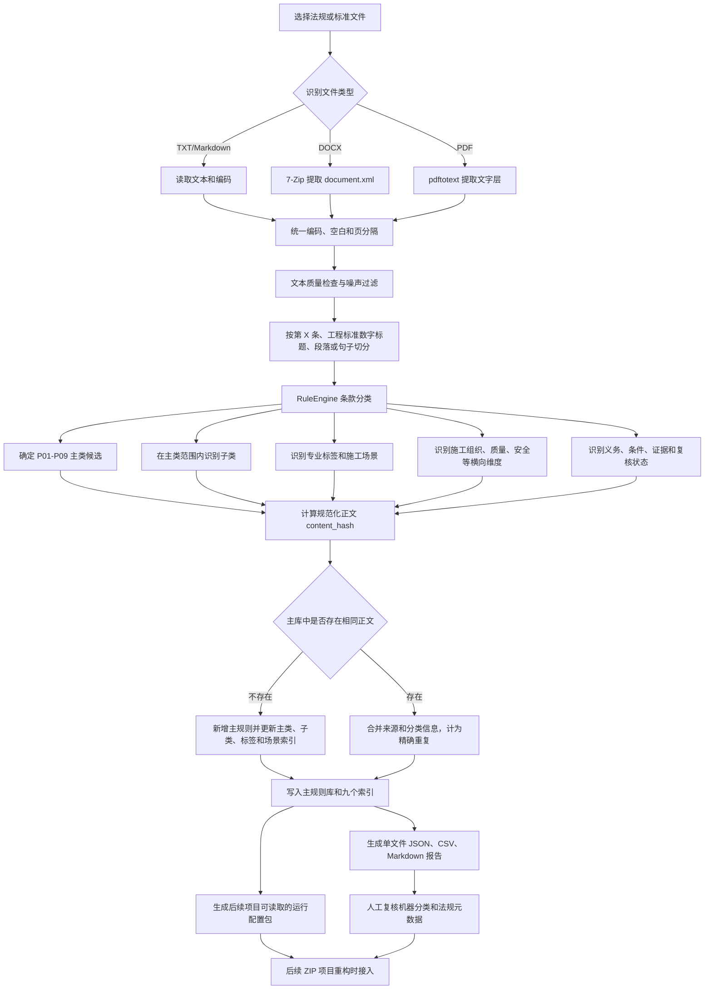

# 工程建设项目法规标准批量处理器

## 软件处理逻辑与操作手册

> 文档版本：当前可测试版本（流程重整版）
>
> 编写日期：2026-09-23
>
> 适用程序：`D:\Code\Codex\标书评分项目\bin\RegulationBatchProcessor.exe`

---

## 1. 文档用途

本文档说明软件的处理流程、九大类分类方法、规则库保存方式、界面操作步骤、输出文件、人工复核方法和人工测试清单。

软件用于把法规、标准和其他工程建设文件转换成可检索的条款记录，辅助施工组织设计和标书评审工作。自动分类结果用于检索和复核，最终的法律适用、项目归类和评审结论仍由人工确认。

当前版本的“检索”是对用户提供的本地文件做文本提取、条款切分和规则匹配，不会自动连接互联网或法规数据库下载文件；法规文件的来源、版本和有效性仍需要使用人员核验。

---

## 2. 当前版本已经具备的功能

- 批量选择 PDF、DOCX、TXT、Markdown 文件；
- 递归添加整个文件夹；
- 提取文本并按条款或段落切分；
- 按 P01—P09 九大类进行透明规则分类；
- 提取施工组织、质量、安全、进度、资源、环境、合同招投标等维度；
- 识别义务强度、适用条件、可核查证据和人工复核提示；
- 生成 JSON、CSV、Markdown 报告；
- 将条款追加到主规则库；
- 使用规范化正文哈希进行精确去重；
- 更新 P01—P09 九个分类索引；
- 生成可供后续评分项目重构使用的运行配置包；
- 在规则库管理窗口中搜索、筛选和查看规则详情；
- 在人工复核窗口中选择类别、填写备注、确认条款并另存复核结果。

---

## 3. 项目目录和重要文件

项目文件统一放在 D 盘：

```text
D:\Code\Codex\标书评分项目\
├─ bin\
│  └─ RegulationBatchProcessor.exe       程序文件
├─ config\
│  └─ rules.json                         分类和维度词库
├─ data\
│  ├─ rule_library.json                  主规则库
│  ├─ README.md                          规则库字段说明
│  └─ indexes\                           九个分类索引
│     ├─ P01.json
│     ├─ P02.json
│     ├─ ...
│     └─ P09.json
├─ output_cpp\                           默认输出目录
├─ ui\                                   Qt Designer 界面文件
├─ cpp\                                  C++ 源码
├─ 启动C++法规处理器.cmd
├─ 部署C++法规处理器.cmd
└─ 编译C++法规处理器.cmd
```

程序会限制输出目录、主规则库、索引目录和人工复核结果位于 `D:\Code\Codex` 下。

---

## 4. 软件总体处理逻辑



### 4.1 分步骤说明

| 步骤 | 软件处理内容 | 产生的结果 |
|---|---|---|
| 1. 输入 | 读取用户选择的文件或文件夹 | 文件队列 |
| 2. 提取 | 根据后缀选择 TXT、DOCX 或 PDF 提取方式 | 原始文本、页码和提取警告 |
| 3. 规范化 | 统一编码、空白、页分隔和标题格式 | 可稳定比较的文本 |
| 4. 质量检查 | 检查 PDF 实质文本、目录/页码/水印和疑似编码异常 | warning、`needs_ocr` 或待处理文本 |
| 5. 条款切分 | 优先识别“第 X 条”；工程标准识别 `1.0.1` 等数字标题，否则按段落或句子切分 | 带来源定位的条款列表 |
| 6. 主类分类 | 按工程对象和场景匹配 P01—P09 | 主类候选、分数和分类证据 |
| 7. 细分标注 | 在主类范围内匹配 59 个子类，并补充专业标签、施工场景 | 子类、标签和场景代码 |
| 8. 维度识别 | 识别施工组织、质量、安全、进度、资源、环境、合同招投标 | 横向评分维度、义务和适用条件 |
| 9. 去重合并 | 对规范化正文计算 SHA-256，新增或合并相同正文 | 稳定的 `rule_id` 和来源集合 |
| 10. 保存索引 | 写主规则库，并重建 P01—P09、子类、标签和场景索引 | 可检索的主库和索引 |
| 11. 生成报告 | 为每个文件生成 JSON、CSV、Markdown 和批次汇总 | 可阅读、可审计的处理结果 |
| 12. 导出运行包 | 把主库规则聚合为后续项目能够读取的法规配置 | `export/inspection-and-review-system` |
| 13. 人工复核 | 处理多候选、待判定、质量告警和法规元数据确认 | `.reviewed.json` 和后续确认依据 |

### 4.2 必须分开理解的四层信息

软件记录的是“条款级”信息。一个法规文件会被拆成多条条款，每条条款分别分类；软件不会把整本法规强行归为一个主类。

1. **九大类（P01—P09）**：表示条款主要服务的工程建设对象或工程场景，是项目路由的第一层。
2. **子类（59 个）**：表示某个 P 类内部更具体的工程对象或工序，只能在对应主类范围内解释。
3. **专业标签和施工场景**：用于补充专业、工艺、区域和作业场景，允许跨主类复用。
4. **横向维度**：施工组织、质量、安全、进度、资源、环境、合同招投标等，是评审和检索维度，可以同时挂在任意 P 类条款上。

例如，“基坑支护验收”可以归入房屋建筑主类，子类标为地基基础或基坑工程，同时拥有质量和安全维度。不能因为它属于质量或安全，就把“质量”或“安全”当成第十类主类。

### 4.3 条款分类和项目分类的边界

- 条款级：软件自动给出 P01—P09 候选、子类、标签、场景和维度。
- 项目级：后续评分项目根据项目主要建设对象、工程量、专业范围和风险，确认项目的主 `ProjectProfile`。
- 当一条条款出现 `multiple_candidates` 或 `needs_review` 时，软件保留候选和证据，不擅自覆盖人工判断。
- 只有确认后的项目主类，才适合用来选择后续评分项目的法规包；通用条款仍可进入 `common.json`。

### 4.4 从输入到后续重构的生命周期

```text
法规/标准文件
  → 文本提取
  → 条款结构化
  → P01-P09 分类
  → 子类、标签、场景和横向维度标注
  → 主规则库精确去重与索引
  → 运行配置包
  → 后续评分项目读取和路由
```

当前 Qt 软件负责文件提取、条款分类、主库去重、索引维护和运行配置包导出；`D:\Code\VsCode\inspection-and-review-system-feature-7.18.zip` 只作为后续接入目标，目前没有被修改。

### 4.5 规则库建设流程和项目使用流程不是同一条线

系统实际有两条相互衔接的流程：

**A. 规则库建设流程（当前 Qt 软件）**

```text
法律法规/标准文件
  → 提取条款
  → 条款分类和标注
  → 主规则库、索引和运行包
```

这条流程不要求先给出某一个具体项目。软件先把法规条款整理成可复用的标准化资源。

**B. 项目评审使用流程（后续评分项目）**

```text
项目资料和招标文件
  → 确定项目主 ProjectProfile
  → 选择 P01-P09、子类、标签和场景
  → 加载 common.json 与对应项目法规包
  → 按招标文件评审因素调用规则
  → 形成评审结果
```

因此，建设法规规则库时可以先处理法规；真正评审一个具体项目时，再从项目出发选择和加载规则。前一条线负责“把法规整理好”，后一条线负责“在项目中使用哪些法规”。

---

## 5. 九大类分类规则

九大类按工程建设对象和工程场景划分。施工、质量、安全属于横向规则维度，可以同时出现在九大类中的任何一类；它们不是九大类本身。

| 编号 | 主类名称 | 典型识别对象 |
|---|---|---|
| P01 | 房屋建筑新建及扩建工程 | 住宅、办公楼、综合楼、教学楼、厂房、仓库、主体结构、地基基础、建筑屋面 |
| P02 | 建筑装饰、修缮及既有建筑改造工程 | 既有建筑、修缮、装修改造、翻新、拆除、加固、外立面、屋面维修 |
| P03 | 市政道路、桥梁及交通工程 | 城市道路、城市桥梁、人行道、慢行系统、交通导改、停车场、广场 |
| P04 | 市政管网、排水及防涝工程 | 雨污水、给水、燃气、热力、电力排管、综合管廊、检查井、顶管、排水防涝 |
| P05 | 水利工程 | 河道治理、清淤、疏浚、堤防、护岸、水库、水闸、围堰、施工导流、防汛度汛 |
| P06 | 高标准农田及土地整治工程 | 高标准农田、耕地、土地平整、田间道路、灌溉渠、排水沟、土壤改良、机井 |
| P07 | 乡村建设及农村人居环境整治工程 | 美丽乡村、自然村、农村人居环境、农村污水、农村公厕、村道、村庄公共空间 |
| P08 | 综合设施提升工程 | 院区、园区、场区、校园综合提升、医院院区、产业园、生产基地、系统切换 |
| P09 | 公路工程 | 高速公路、国道、省道、县道、农村公路、公路桥、公路隧道、路基、路面、施工保通 |

### 5.1 分类判定方式

软件按照以下顺序进行机器分类：

1. `core_keywords`：识别工程对象的核心词；
2. `keywords`：作为辅助证据；
3. `negative`：对不适用的场景扣分；
4. 根据得分保留一个或多个候选类别；
5. 把命中词、核心词、排除词和分数写入 `category_evidence`。

### 5.2 分类状态

| 状态 | 含义 | 人工处理建议 |
|---|---|---|
| `classified` | 只有一个主要候选类别 | 抽查后可以确认 |
| `multiple_candidates` | 同时命中多个类别 | 根据主要建设对象和工程量确认 |
| `needs_review` | 没有足够信息判定 | 人工选择 P01—P09，或保留待复核 |

“待判定”不是第十类，不会进入 P01—P09 分类索引。

### 5.3 规则维度

软件目前识别以下横向维度：

- 施工组织；
- 质量；
- 安全；
- 进度；
- 资源；
- 环境；
- 合同招投标。

同一条款可以同时拥有多个维度。例如，一条“基坑支护验收”条款可能同时属于质量和安全维度。

---

## 6. 文件提取逻辑和限制

### 6.1 TXT 和 Markdown

- 支持 UTF-8、UTF-16、UTF-32 BOM；
- 无 BOM 的中文文件会尝试按 GB18030/GBK 读取；
- 以行首“第 X 条”识别法律法规条款编号；
- 没有“第 X 条”结构时，识别工程标准常见的 `1.0.1`、`13.4.1` 等行首数字标题；
- 会保留短条款，并在必要时增加人工复核提示；目录和页码等无实质内容片段会跳过。

### 6.2 DOCX

- 使用 `7z.exe` 提取 `word/document.xml`；
- 读取正文和表格单元格文字；
- 不读取页眉、页脚、脚注、图片文字和部分文本框文字；
- 页码不从 Word XML 中推算，结果中的页码可能为 0；
- 文件损坏、加密或仅包含图片时会生成 warning 或 failed。

### 6.3 PDF

- 使用 `pdftotext -layout` 读取 PDF 文字层；
- 保留页面分隔符，并记录 `source_page` 和 `source_page_end`；
- 工程标准支持 `1.0.1`、`13.4.1` 等数字条款标题，也兼容全角数字和标点；目录中的引导点、页码和公告式编号不会作为条款标题；
- 目录、页码、下载站水印和仅含符号的片段会在分类前过滤，并在结果中计入 `skipped_noise`，不会写入主规则库；
- 对 PDF 实质文本量进行检查。实质文本过少、疑似只有水印或没有可识别文字时，报告会写入 warning，必要时标记 `needs_ocr`；
- 当字体或编码提取疑似异常时，报告会提示“建议换源或 OCR”，明显不可读片段会跳过规则库写入；
- 扫描型 PDF 没有文字层时会标记 `needs_ocr`；
- 当前版本不包含 OCR，需要先将文件 OCR 化，或等待后续 OCR 功能。

---

## 7. 主规则库和九个索引

### 7.1 主规则库

主规则库文件：

```text
D:\Code\Codex\标书评分项目\data\rule_library.json
```

主规则库中的每条规则主要包含：

- `rule_id`：主规则库编号，格式为 `RL-...`；
- `content_hash`：规范化正文的 SHA-256；
- `title`、`text`：标题和正文；
- `categories`、`category_names`：机器识别到的九大类；
- `dimensions`：施工组织、质量、安全等维度；
- `sources`：来源文件、页码、条款号和原始规则编号；
- `status`：新规则默认为 `pending_review`；
- `version`、`first_seen_at`、`last_seen_at`：版本和时间；
- `similar_rule_ids`：预留的疑似相似规则编号；
- `notes`：规则备注。

### 7.2 九个分类索引

索引目录：

```text
D:\Code\Codex\标书评分项目\data\indexes\
```

每个索引只保存主规则库编号，不复制规则正文：

```text
P01.json  P02.json  P03.json  P04.json  P05.json
P06.json  P07.json  P08.json  P09.json
```

一条规则可以同时进入多个索引，但主规则库中仍然只保存一份正文。

除九个主类索引外，主库还维护以下辅助索引：

- `subcategory_rule_ids`：按子类代码检索；
- `professional_tag_rule_ids`：按专业标签检索；
- `scene_rule_ids`：按施工场景检索。

这些索引都只保存 `rule_id`。打开主库时，程序会根据主规则库重新构建索引，并清理已经不存在的规则编号；子类索引还会校验其所属的 P 类，避免把子类挂到错误的主类下。

因此，九大类是主路由索引，子类、标签和场景是辅助检索索引，横向维度则用于评审因素和运行包映射。四者保存的是不同层次的信息，不能互相替代。

### 7.3 精确去重方式

软件会对正文做统一规范化处理：

- Unicode 兼容规范化；
- 统一大小写；
- 简化空白；
- 删除空白、标点和符号；
- 对规范化后的正文计算 SHA-256。

处理结果分为三类：

| 结果 | 处理方式 |
|---|---|
| 新增 | 写入主规则库，并把 `rule_id` 加入命中的 P01—P09 索引 |
| 精确重复 | 不新增正文，合并新的来源和类别，更新索引 |
| 写入失败 | 保留错误信息，批次统计中增加失败数量 |

当前版本不会自动判断“语义相似”。内容相近但无法确认完全相同的条款，需要人工复核。

### 7.4 追加新法规时的处理顺序

后续添加新文件时，不需要手工编辑九个索引，也不需要先判断整本法规属于哪一类。程序按以下顺序追加：

1. 提取新文件并拆成条款；
2. 为每条条款计算主类候选、子类、标签、场景和维度；
3. 用正文 `content_hash` 与主规则库比较；
4. 新正文写入主库，相同正文合并来源和分类信息；
5. 统一重建主类、子类、标签和场景索引；
6. 从最新主库重新导出运行配置包。

这样可以重复处理同一批文件而不重复增加正文；同一条款在不同法规或不同分类命中下，也能保留多个来源和索引关系。

---

## 8. 输出文件说明

每个输入文件通常会在输出目录生成以下文件：

| 文件 | 用途 |
|---|---|
| `文件名.rules.json` | 完整结构化规则和机器分类依据 |
| `文件名.rules.csv` | 便于用 Excel 或表格软件复核 |
| `文件名.report.md` | 便于用 Typora 阅读的处理报告 |
| `文件名.extracted.txt` | 提取出的纯文本，便于和原文件对照 |
| `batch.summary.json` | 本批次文件、条款、警告、错误和规则库统计 |

如果输出目录中已经存在同名结果，程序会自动使用 `_2`、`_3` 等后缀，避免覆盖旧结果。

`batch.summary.json` 中的规则库统计示例：

```json
"rule_library": {
    "added": 201,
    "duplicates": 32,
    "errors": 0,
    "skipped_noise": 17
},
"skipped_noise": 17
```

`skipped_noise` 表示本批次被识别为目录、页码、水印、符号片段或明显不可读片段而跳过的数量。它不等于规则库写入失败；如数量异常偏高，应打开对应的 `.extracted.txt` 和 `.report.md` 核对原文，并考虑更换 PDF 来源或执行 OCR。

---

## 9. 运行前准备

### 9.1 启动程序

推荐双击：

```text
D:\Code\Codex\标书评分项目\启动C++法规处理器.cmd
```

也可以直接双击：

```text
D:\Code\Codex\标书评分项目\bin\RegulationBatchProcessor.exe
```

### 9.2 PDF 工具

处理 PDF 前需要 `pdftotext.exe`。如果界面没有自动找到，请点击“选择”，指定 Poppler 或 TeX Live 中的 `pdftotext.exe`，例如：

```text
D:\texlive\2026\bin\windows\pdftotext.exe
```

### 9.3 DOCX 工具

处理 DOCX 前需要 `7z.exe`。当前常用路径为：

```text
D:\software\7Zip\7-Zip\7z.exe
```

### 9.4 Qt 运行环境

如果启动时提示缺少 Qt DLL 或 `windows` 平台插件，先双击：

```text
D:\Code\Codex\标书评分项目\部署C++法规处理器.cmd
```

部署脚本会调用 `windeployqt`，补齐 Qt DLL、MinGW 运行库和 `platforms` 下的平台插件，并生成 `bin\qt.conf`。启动脚本会固定使用程序目录中的插件路径，避免系统 Qt 环境变量造成平台插件加载错误。

---

## 10. 主窗口操作步骤

### 第一步：添加文件

点击“添加文件”，选择一个或多个 PDF、DOCX、TXT 或 Markdown 文件。

如果需要处理整个文件夹，点击“添加文件夹”。程序会递归读取其中的支持类型文件。

文件列表中的操作：

- “移除选中”：删除选中的待处理文件；
- “清空”：清空全部待处理文件；
- 文件不会因为点击移除而被删除。

### 第二步：确认配置

检查“输出与工具配置”区域：

| 控件 | 默认或建议值 |
|---|---|
| 输出目录 | `D:\Code\Codex\标书评分项目\output_cpp` |
| 分类规则 | `D:\Code\Codex\标书评分项目\config\rules.json` |
| PDF 工具 | `pdftotext.exe` |
| DOCX 工具 | `7z.exe` |

输出目录必须位于 `D:\Code\Codex` 下。程序不会把生成的报告写入 C 盘。

### 第三步：开始处理

点击“开始批量处理”。处理过程中：

- 进度条显示当前文件进度；
- 日志区域显示正在处理的文件和条款数；
- 当前批次会在后台线程执行，界面不会因为单个文件处理而失去响应。

### 第四步：查看完成统计

处理完成后，窗口会显示：

- 处理文件数；
- 提取规则数；
- 已跳过噪声数；
- 规则库新增数；
- 规则库精确重复数；
- 规则库写入失败数；
- warning 数量和错误数量。

### 第五步：查看输出

点击“打开输出目录”，检查每个文件的 `.rules.json`、`.rules.csv`、`.report.md` 和 `batch.summary.json`。

---

## 11. 打开人工复核

人工复核用于核对机器分类，不会覆盖原始自动处理结果。

1. 在主窗口点击“打开人工复核”；
2. 选择某个 `文件名.rules.json`；
3. 左侧选择条款；
4. 查看右侧“原文”和“机器分类依据”；
5. 在“人工分类与备注”区域勾选正确的 P01—P09；
6. 填写复核说明；
7. 点击“确认当前条款”或“保存草稿”；
8. 点击“保存”或“另存为”。

复核结果必须另存为 D 盘下的 `.json` 文件，不能覆盖原始自动处理结果。建议使用：

```text
文件名.reviewed.json
```

人工复核结果目前保存为独立复核文件，不会自动回写主规则库。需要人工确认后，再由后续规则库维护步骤统一整理。

---

## 12. 规则库管理窗口操作

在主窗口点击“规则库管理”。窗口会读取：

```text
D:\Code\Codex\标书评分项目\data\rule_library.json
```

### 12.1 搜索

在搜索框输入规则编号、标题、关键词或正文片段，左侧列表会实时过滤。

### 12.2 按主类筛选

在“主类”下拉框选择 P01—P09。筛选依据是规则的 `categories` 字段。

### 12.3 按维度筛选

可以选择施工组织、质量、安全、进度、资源、环境、合同招投标等维度。

### 12.4 按状态筛选

- 待复核：主规则库新追加规则的默认状态；
- 已确认：预留给后续规则库确认流程；
- 疑似重复：用于查看已经标记相似关系的规则。

### 12.5 查看详情

选中左侧规则后，右侧显示：

- 规则原文；
- 来源文件、页码和条款号；
- P01—P09 分类索引；
- 机器分类依据、命中关键词、证据词和复核提示；
- 规则编号、状态和备注。

批处理完成后如果规则库窗口已经打开，点击“刷新”读取最新内容。

当前“追加规则”和“导出”按钮仍为预留功能，处于禁用状态。

---

## 13. 人工测试清单

建议按以下顺序测试，每项完成后在最后一列记录结果。

| 序号 | 测试内容 | 预期结果 | 结果 |
|---:|---|---|---|
| 1 | 双击启动程序 | 主窗口正常显示 | [ ] |
| 2 | 添加一个 TXT 文件 | 文件出现在待处理列表 | [ ] |
| 3 | 添加一个 PDF 文件 | 文件出现在待处理列表 | [ ] |
| 4 | 添加一个 DOCX 文件 | 文件出现在待处理列表 | [ ] |
| 5 | 点击“开始批量处理” | 进度条和日志正常更新 | [ ] |
| 6 | 查看输出目录 | 生成 JSON、CSV、Markdown 报告 | [ ] |
| 7 | 查看 `batch.summary.json` | 有文件、规则、警告和规则库统计 | [ ] |
| 8 | 第一次处理同一文件 | 新增数量大于零或按内容实际统计 | [ ] |
| 9 | 第二次处理同一文件 | 新增数量不增加，重复数量增加 | [ ] |
| 10 | 打开“规则库管理” | 能看到主库规则 | [ ] |
| 11 | 输入规则编号搜索 | 列表只显示匹配规则 | [ ] |
| 12 | 选择 P01 筛选 | 只显示 P01 规则 | [ ] |
| 13 | 选中一条规则 | 右侧显示原文和来源 | [ ] |
| 14 | 打开“人工复核” | 能查看条款和机器依据 | [ ] |
| 15 | 修改类别并保存 | 生成 `.reviewed.json`，原始结果不被覆盖 | [ ] |
| 16 | 选择不存在的 PDF 工具 | 显示明确错误或 warning | [ ] |
| 17 | 处理扫描型 PDF | 标记 `needs_ocr`，不伪装为成功 | [ ] |
| 18 | 关闭程序后重新打开规则库 | 已保存主库规则仍然存在 | [ ] |

---

## 14. 常见问题处理

### 14.1 程序启动提示 Qt 平台插件错误

运行：

```text
D:\Code\Codex\标书评分项目\部署C++法规处理器.cmd
```

然后重新启动程序。

### 14.2 PDF 没有提取出文字

检查：

1. “PDF 工具（pdftotext）”路径是否正确；
2. PDF 是否为扫描图片；
3. 是否需要先 OCR；
4. 输出报告中的 warning 和 `needs_ocr` 状态。

### 14.3 PDF 显示实质文本过少、只有水印或编码异常

程序会把页码、目录引导点、常见下载站水印和明显不可读片段从规则库写入流程中排除，并在文件结果和 `batch.summary.json` 中记录 `skipped_noise`。如果同时看到“PDF 提取到的实质文本过少”或“疑似编码/字体提取异常”的 warning：

1. 打开同名 `.extracted.txt`，确认文字是否可读；
2. 重新下载文字层质量更好的 PDF，或先对扫描件执行 OCR；
3. 检查 `.report.md` 中的“已跳过噪声”和警告数量；
4. 确认有效条款没有被误过滤后，再把结果纳入人工复核。

### 14.4 DOCX 无法读取

检查 `7z.exe` 路径。加密 DOCX、损坏 DOCX 或仅含图片的 DOCX 可能无法提取正文。

### 14.5 规则显示为“待判定”

这表示条款文字不足以确定工程主类。它不是新的类别，也不表示程序出错。应结合工程对象、工程量、主要工艺和风险，在人工复核中选择 P01—P09。

### 14.6 同一条款为什么显示精确重复

程序按规范化正文的 `content_hash` 去重。标点、空格和大小写差异可能被规范化为相同正文。相似但内容确实不同的条款，需要人工确认，程序不会自动合并所有相似条款。

### 14.7 输出目录无法选择或处理失败

确认输出目录位于：

```text
D:\Code\Codex\
```

例如可以使用：

```text
D:\Code\Codex\标书评分项目\output_cpp
D:\Code\Codex\测试输出
```

---

## 15. 数据备份和恢复建议

在批量处理大量新文件前，先复制以下目录到 D 盘备份位置：

```text
D:\Code\Codex\标书评分项目\data\
```

其中：

- `rule_library.json` 是主规则库；
- `indexes` 是九个分类索引；
- 主库和索引需要一起备份和恢复。

输出报告可以单独备份，但不能替代主规则库。

---

## 16. 可供后续重构直接使用的运行配置包

每次点击“开始批量处理”并成功写入主规则库后，程序会自动生成或刷新：

```text
D:\Code\Codex\标书评分项目\export\inspection-and-review-system\
```

也可以在主窗口的“重构运行包”输入框中选择 D 盘下的其他目录。该目录不是临时报告目录，而是后续评分项目的配置输入目录。核心文件如下：

| 文件 | 用途 |
|---|---|
| `config/regulations/common.json` | 全部法规条目的兼容包 |
| `config/regulations/municipal_road.json` 等 | 按项目类型拆分的法规包 |
| `config/classification/project_categories.json` | P01—P09、59 个子类、专业标签和场景 |
| `config/classification/project_profiles.json` | 后续 `ProjectProfile` 路由配置 |
| `config/mappings/project_type_map.json` | 九大类到项目类型的路由映射 |
| `config/mappings/dimension_to_runtime_items.json` | 施工、质量、安全等维度到目标评分条目的映射 |
| `data/regulation_master.json` | Qt 主库快照，便于追溯来源 |
| `package_manifest.json` | 版本、数量、警告和运行字段契约 |

目标项目当前加载器要求法规文件根节点为 `regulations`。每条法规的固定兼容字段为：

```text
code, title, issued_by, level, is_mandatory,
applies_to_items, applies_to_factors, keywords,
scope_clause, requirement_text, non_comply_action
```

程序还会写入 `standard_code`、`source_rule_ids`、`category_codes`、`subcategory_codes`、`professional_tag_codes`、`scene_codes`、`review_status` 等扩展字段，供后续 ProjectProfile 和规则路由使用。

运行包中的一条 `regulations` 记录可能对应主库中的多条相同标准或相同法规来源条款。`source_rule_ids` 保存聚合前的主库编号，`clause_count` 保存条款数量。因此要追溯原文时，应先查运行包记录，再按 `source_rule_ids` 回到 `data/regulation_master.json`。

自动识别条款默认标为 `pending_review`；人工确认后可在复核结果中看到 `confirmed`。当前版本不把条款中的“必须/应当”直接当作文档强制性，也不自动生成评分封顶动作；缺少明确法规元数据时使用 `is_mandatory=false` 和 `non_comply_action=warning_only`。

当前步骤只生成配置包，不修改 `D:\Code\VsCode\inspection-and-review-system-feature-7.18.zip`。后续重构时，以 `package_manifest.json` 和 `config/regulations` 作为输入协议进行接入。

运行包的状态关系如下：

```text
主规则库（完整、可追溯）
  → 按标准和项目类型聚合
  → config/regulations/*.json（目标项目运行格式）
  → package_manifest.json（数量、字段和警告校验）
```

主库中的待复核条款也会进入运行包，并带有 `review_status=pending_review` 和 `pending_review=true`。这保证后续程序可以先加载配置，同时保留人工确认入口；正式上线前应根据 `package_manifest.json` 和复核结果筛选确认版规则。

后续可以按以下顺序扩展：

1. 将人工复核的子类、标签和法规元数据回写主规则库；
2. 增加确认版运行包筛选；
3. 增加法规版本、生效、修订和废止关系；
4. 增加 PDF OCR；
5. 将法规规则与招标文件评审因素关联。

---

## 17. 相关文件

- [项目 README](README.md)
- [九大类处理逻辑说明](工程建设项目九大类处理逻辑.md)
- [规则库数据说明](data/README.md)
- [主规则库](data/rule_library.json)
- [程序文件](bin/RegulationBatchProcessor.exe)
- [运行包字段契约](config/regulation_schema/regulation_runtime.schema.json)
- [阶段性工作汇报](标书评分项目阶段性工作汇报.md)
